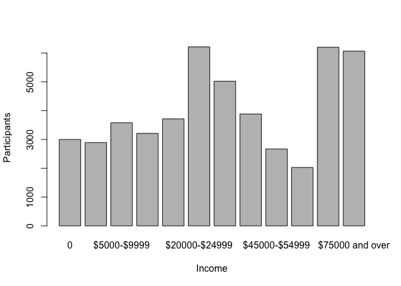
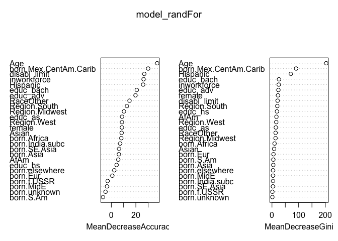
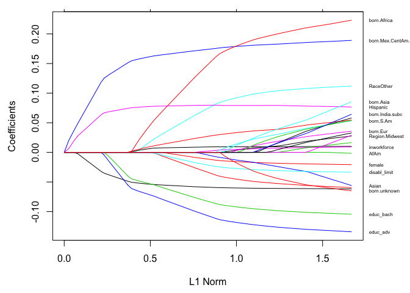
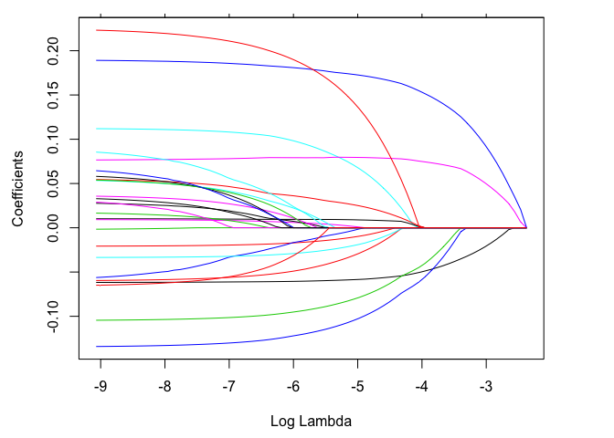
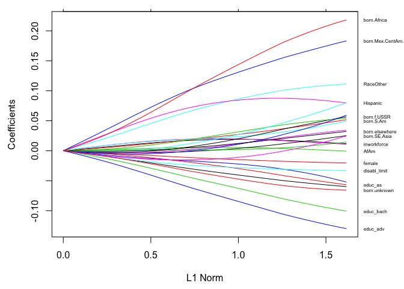
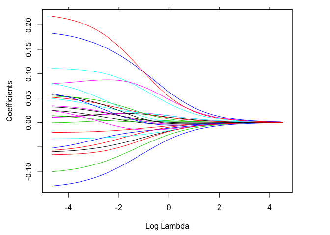
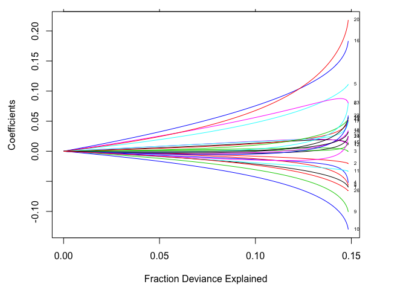
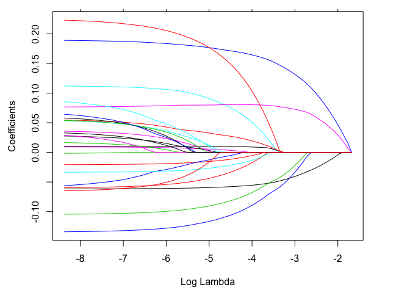
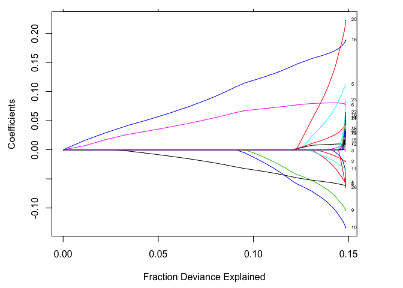

Homework 7, Econ B2000
================
Christopher Tinevra & Nicole Kerrison
11/17/2020

## Econ B2000,LAB 7 Results

``` r
load("~/Library/Mobile Documents/com~apple~CloudDocs/Economics Master/Econometrics/Labs/ecob2000_lab7-main/NHIS_2014.RData")
```

The purpose of this lab is to understand the factors that make an adult
more likely to have health insurance. Data was collected from the
National Health Interview Survey.

The graph below illustrates the income ranges for the participants of
the National Health Interview Survey.

``` r
data_use1$earn_lastyr <- as.factor(data_use1$ERNYR_P)
levels(data_use1$earn_lastyr) <- c("0","$01-$4999","$5000-$9999","$10000-$14999","$15000-$19999","$20000-$24999","$25000-$34999","$35000-$44999","$45000-$54999","$55000-$64999","$65000-$74999","$75000 and over",NA,NA,NA)

plot(data_use1$earn_lastyr, xlab= "Income", ylab = "Participants")
```

<!-- -->

We want to create a subset from the initial data frame of the survey for
Adults 21 and older. We are condidering this assumption becasue most
adults out of college are likely to participate in the labor force and
would likely have a health insurance plan.

``` r
use_varb <- (data_use1$AGE >= 21) 
adult_use_data <- subset(data_use1,use_varb) 
suppressMessages(attach(adult_use_data))

model_logit1 <- glm(NOTCOV ~ AGE_P + I(AGE_P^2) + female + AfAm + Asian + RaceOther + Hispanic + educ_hs + educ_as + educ_bach + educ_adv + veteran_stat + REGION + region_born + disabl_limit + inworkforce, family = binomial, data = adult_use_data)
summary(model_logit1)
```

    ## 
    ## Call:
    ## glm(formula = NOTCOV ~ AGE_P + I(AGE_P^2) + female + AfAm + Asian + 
    ##     RaceOther + Hispanic + educ_hs + educ_as + educ_bach + educ_adv + 
    ##     veteran_stat + REGION + region_born + disabl_limit + inworkforce, 
    ##     family = binomial, data = adult_use_data)
    ## 
    ## Deviance Residuals: 
    ##     Min       1Q   Median       3Q      Max  
    ## -1.7257  -0.5856  -0.3530  -0.1545   3.5850  
    ## 
    ## Coefficients:
    ##                                 Estimate Std. Error z value Pr(>|z|)    
    ## (Intercept)                   -2.734e+00  1.120e-01 -24.400  < 2e-16 ***
    ## AGE_P                          8.743e-02  5.269e-03  16.592  < 2e-16 ***
    ## I(AGE_P^2)                    -1.418e-03  6.018e-05 -23.558  < 2e-16 ***
    ## female                        -2.890e-01  2.302e-02 -12.557  < 2e-16 ***
    ## AfAm                           1.106e-02  3.364e-02   0.329 0.742319    
    ## Asian                         -1.684e-01  7.843e-02  -2.147 0.031801 *  
    ## RaceOther                      5.783e-01  6.762e-02   8.553  < 2e-16 ***
    ## Hispanic                       3.522e-01  3.612e-02   9.750  < 2e-16 ***
    ## educ_hs                        4.741e-02  2.581e-02   1.837 0.066210 .  
    ## educ_as                       -5.172e-01  3.945e-02 -13.110  < 2e-16 ***
    ## educ_bach                     -1.243e+00  4.041e-02 -30.762  < 2e-16 ***
    ## educ_adv                      -1.902e+00  6.948e-02 -27.370  < 2e-16 ***
    ## veteran_stat                  -7.391e-01  5.951e-02 -12.421  < 2e-16 ***
    ## REGIONMidwest                  2.254e-01  4.146e-02   5.436 5.45e-08 ***
    ## REGIONSouth                    6.147e-01  3.582e-02  17.162  < 2e-16 ***
    ## REGIONWest                     2.273e-01  3.784e-02   6.008 1.88e-09 ***
    ## region_bornMex Cent Am Caribb  1.052e+00  3.883e-02  27.087  < 2e-16 ***
    ## region_bornS Am                8.420e-01  8.592e-02   9.800  < 2e-16 ***
    ## region_bornEur                 3.019e-01  1.039e-01   2.906 0.003660 ** 
    ## region_bornformer USSR         8.218e-01  2.158e-01   3.808 0.000140 ***
    ## region_bornAfrica              6.415e-01  1.095e-01   5.860 4.62e-09 ***
    ## region_bornMidE                3.537e-01  1.782e-01   1.985 0.047145 *  
    ## region_bornIndia subc          6.080e-01  1.263e-01   4.813 1.49e-06 ***
    ## region_bornAsia                8.349e-01  1.157e-01   7.214 5.44e-13 ***
    ## region_bornSE Asia             3.748e-01  1.067e-01   3.513 0.000443 ***
    ## region_bornElsewhere           2.489e-01  1.624e-01   1.533 0.125333    
    ## region_bornunknown             7.156e-02  1.900e-01   0.377 0.706502    
    ## disabl_limit                  -3.651e-01  4.258e-02  -8.573  < 2e-16 ***
    ## inworkforce                    7.853e-03  2.997e-02   0.262 0.793285    
    ## ---
    ## Signif. codes:  0 '***' 0.001 '**' 0.01 '*' 0.05 '.' 0.1 ' ' 1
    ## 
    ## (Dispersion parameter for binomial family taken to be 1)
    ## 
    ##     Null deviance: 65567  on 79768  degrees of freedom
    ## Residual deviance: 53339  on 79740  degrees of freedom
    ## AIC: 53397
    ## 
    ## Number of Fisher Scoring iterations: 6

``` r
notcovered<-sum(adult_use_data$NOTCOV=="1")
print(paste("Adults not covered:", notcovered)) 
```

    ## [1] "Adults not covered: 11434"

``` r
covered<-sum(adult_use_data$NOTCOV=="0")
print(paste("Adults covered:", covered))
```

    ## [1] "Adults covered: 68335"

``` r
totaln<-length(adult_use_data$NOTCOV)
print(paste("Total adults:", totaln))
```

    ## [1] "Total adults: 79769"

``` r
p.notcovered<-notcovered/totaln
print(paste("Proportion not covered:", signif(p.notcovered,2))) 
```

    ## [1] "Proportion not covered: 0.14"

``` r
p.covered<-covered/totaln
print(paste("Proportion covered:", signif(p.covered,2))) 
```

    ## [1] "Proportion covered: 0.86"

Creating a data frame composed of possible independent variables that
can affect the insurance coverage of an individual, also taking into
consideration if the individuals are in the work force and if there are
disability limitations.

``` r
d_region <- data.frame(model.matrix(~ adult_use_data$REGION))
d_region_born <- data.frame(model.matrix(~ factor(adult_use_data$region_born)))

dat_for_analysis_sub <- data.frame(
  adult_use_data$NOTCOV,
  adult_use_data$AGE_P,
  adult_use_data$female,
  adult_use_data$AfAm,
  adult_use_data$Asian,
  adult_use_data$RaceOther,
  adult_use_data$Hispanic,
  adult_use_data$educ_hs,
  adult_use_data$educ_as,
  adult_use_data$educ_bach,
  adult_use_data$educ_adv,
  adult_use_data$disabl_limit,
  adult_use_data$inworkforce,
  d_region[,2:4],
  d_region_born[,2:12])

names(dat_for_analysis_sub) <- c("NOTCOV",
                                 "Age",
                                 "female",
                                 "AfAm",
                                 "Asian",
                                 "RaceOther",
                                 "Hispanic",
                                 "educ_hs",
                                 "educ_as",
                                 "educ_bach",
                                 "educ_adv",
                                 "disabl_limit",
                                 "inworkforce",
                                 "Region.Midwest",
                                 "Region.South",
                                 "Region.West",
                                 "born.Mex.CentAm.Carib",
                                 "born.S.Am",
                                 "born.Eur",
                                 "born.f.USSR",
                                 "born.Africa",
                                 "born.MidE",
                                 "born.India.subc",
                                 "born.Asia",
                                 "born.SE.Asia",
                                 "born.elsewhere",
                                 "born.unknown")
```

Furthermore, the variables in use will be standardized while creating
subset data frames to train and test the dependent variable (NOTCOV)
with the various independent variables to predict whether an individual
is covered or not covered under a health insurance plan.

``` r
suppressMessages(require("standardize"))
set.seed(54321)
NN <- length(dat_for_analysis_sub$NOTCOV)
print(NN)
```

    ## [1] 79769

``` r
restrict_1 <- (runif(NN) < 0.1) # using 10% of the data for the training data
summary(restrict_1)
```

    ##    Mode   FALSE    TRUE 
    ## logical   71695    8074

``` r
dat_train <- subset(dat_for_analysis_sub, restrict_1)
dat_test <- subset(dat_for_analysis_sub, !restrict_1)
sobj <- standardize(NOTCOV ~ Age + female + AfAm + Asian + RaceOther + Hispanic + 
                      educ_hs + educ_as + educ_bach + educ_adv + disabl_limit + inworkforce+
                      Region.Midwest + Region.South + Region.West + 
                      born.Mex.CentAm.Carib + born.S.Am + born.Eur + born.f.USSR + 
                      born.Africa + born.MidE + born.India.subc + born.Asia + 
                      born.SE.Asia + born.elsewhere + born.unknown, dat_train, family = binomial)

s_dat_train <- predict(sobj,dat_train)
s_dat_test <- predict(sobj, dat_test)

summary(s_dat_train)
```

    ##         Age.V1        female   AfAm     Asian    RaceOther Hispanic educ_hs 
    ##  Min.   :-1.6180828   1:4361   1:1103   1: 568   1: 138    1:1563   1:2176  
    ##  1st Qu.:-0.8564844   0:3713   0:6971   0:7506   0:7936    0:6511   0:5898  
    ##  Median :-0.0363015                                                         
    ##  Mean   : 0.0000000                                                         
    ##  3rd Qu.: 0.7252969                                                         
    ##  Max.   : 2.1313247                                                         
    ##  educ_as  educ_bach educ_adv disabl_limit inworkforce Region.Midwest
    ##  1: 897   1:1423    1: 793   1:1266       1:5361      1:1651        
    ##  0:7177   0:6651    0:7281   0:6808       0:2713      0:6423        
    ##                                                                     
    ##                                                                     
    ##                                                                     
    ##                                                                     
    ##  Region.South Region.West born.Mex.CentAm.Carib born.S.Am born.Eur born.f.USSR
    ##  1:2827       1:2301      1: 939                1: 100    1: 127   1:  18     
    ##  0:5247       0:5773      0:7135                0:7974    0:7947   0:8056     
    ##                                                                               
    ##                                                                               
    ##                                                                               
    ##                                                                               
    ##  born.Africa born.MidE born.India.subc born.Asia born.SE.Asia born.elsewhere
    ##  1:  56      1:  32    1: 120          1: 111    1: 179       1:  45        
    ##  0:8018      0:8042    0:7954          0:7963    0:7895       0:8029        
    ##                                                                             
    ##                                                                             
    ##                                                                             
    ##                                                                             
    ##  born.unknown
    ##  1:  26      
    ##  0:8048      
    ##              
    ##              
    ##              
    ## 

``` r
summary(s_dat_test)
```

    ##         Age.V1        female    AfAm      Asian     RaceOther Hispanic 
    ##  Min.   :-1.6180828   1:37785   1: 9729   1: 5087   1: 1292   1:13555  
    ##  1st Qu.:-0.8564844   0:33910   0:61966   0:66608   0:70403   0:58140  
    ##  Median :-0.0363015                                                    
    ##  Mean   :-0.0070603                                                    
    ##  3rd Qu.: 0.7252969                                                    
    ##  Max.   : 2.1313247                                                    
    ##  educ_hs   educ_as   educ_bach educ_adv  disabl_limit inworkforce
    ##  1:19098   1: 7927   1:12922   1: 7320   1:11078      1:47509    
    ##  0:52597   0:63768   0:58773   0:64375   0:60617      0:24186    
    ##                                                                  
    ##                                                                  
    ##                                                                  
    ##                                                                  
    ##  Region.Midwest Region.South Region.West born.Mex.CentAm.Carib born.S.Am
    ##  1:14340        1:24768      1:20547     1: 8163               1:  847  
    ##  0:57355        0:46927      0:51148     0:63532               0:70848  
    ##                                                                         
    ##                                                                         
    ##                                                                         
    ##                                                                         
    ##  born.Eur  born.f.USSR born.Africa born.MidE born.India.subc born.Asia
    ##  1: 1116   1:  200     1:  580     1:  312   1:  920         1: 1053  
    ##  0:70579   0:71495     0:71115     0:71383   0:70775         0:70642  
    ##                                                                       
    ##                                                                       
    ##                                                                       
    ##                                                                       
    ##  born.SE.Asia born.elsewhere born.unknown
    ##  1: 1748      1:  387        1:  211     
    ##  0:69947      0:71308        0:71484     
    ##                                          
    ##                                          
    ##                                          
    ## 

The linear regression and logic model will predict the test data for the
observations and the probability that someone will have health insurance
or not have health insurance.

``` r
# Linear Probability Model
all(is.na(sobj$data))
```

    ## [1] FALSE

``` r
model_lpm1 <- lm(sobj$formula, data = sobj$data)
suppressWarnings(pred_vals_lpm <- predict(model_lpm1, s_dat_test))
pred_model_lpm1 <- (pred_vals_lpm > 0.5)
table1 <- table(pred = pred_model_lpm1,true = dat_test$NOTCOV)
summary(table1)
```

    ## Number of cases in table: 71695 
    ## Number of factors: 2 
    ## Test for independence of all factors:
    ##  Chisq = 1938.3, df = 1, p-value = 0

``` r
print(table1)
```

    ##        true
    ## pred        0     1
    ##   FALSE 61139  9669
    ##   TRUE    304   583

``` r
# logit 
model_logit1 <- glm(sobj$formula, family = binomial, data = sobj$data)
suppressWarnings(pred_vals <- predict(model_logit1, s_dat_test, type = "response"))
pred_model_logit1 <- (pred_vals > 0.5)
table2 <- table(pred = pred_model_logit1, true = dat_test$NOTCOV)
summary(table2)
```

    ## Number of cases in table: 71695 
    ## Number of factors: 2 
    ## Test for independence of all factors:
    ##  Chisq = 5074, df = 1, p-value = 0

``` r
print(table2)
```

    ##        true
    ## pred        0     1
    ##   FALSE 60232  8499
    ##   TRUE   1211  1753

``` r
suppressMessages(require(stargazer))
stargazer(model_lpm1,model_logit1, type = "text")
```

    ## 
    ## ===========================================================
    ##                                Dependent variable:         
    ##                        ------------------------------------
    ##                                        sobj                
    ##                                   OLS             logistic 
    ##                                   (1)               (2)    
    ## -----------------------------------------------------------
    ## Age                            -0.062***         -0.625*** 
    ##                                 (0.004)           (0.043)  
    ##                                                            
    ## female1                        -0.010***          -0.077** 
    ##                                 (0.004)           (0.035)  
    ##                                                            
    ## AfAm1                           -0.001             0.021   
    ##                                 (0.006)           (0.052)  
    ##                                                            
    ## Asian1                         -0.030**           -0.304** 
    ##                                 (0.012)           (0.140)  
    ##                                                            
    ## RaceOther1                     0.056***           0.355*** 
    ##                                 (0.014)           (0.105)  
    ##                                                            
    ## Hispanic1                      0.038***           0.246*** 
    ##                                 (0.007)           (0.055)  
    ##                                                            
    ## educ_hs1                         0.005             0.049   
    ##                                 (0.005)           (0.040)  
    ##                                                            
    ## educ_as1                       -0.030***         -0.262*** 
    ##                                 (0.006)           (0.062)  
    ##                                                            
    ## educ_bach1                     -0.052***         -0.571*** 
    ##                                 (0.006)           (0.063)  
    ##                                                            
    ## educ_adv1                      -0.067***         -1.175*** 
    ##                                 (0.007)           (0.140)  
    ##                                                            
    ## disabl_limit1                  -0.017***         -0.173*** 
    ##                                 (0.006)           (0.064)  
    ##                                                            
    ## inworkforce1                     0.005            0.093**  
    ##                                 (0.005)           (0.046)  
    ##                                                            
    ## Region.Midwest1                 0.015**           0.160**  
    ##                                 (0.006)           (0.065)  
    ##                                                            
    ## Region.South1                  0.028***           0.296*** 
    ##                                 (0.006)           (0.057)  
    ##                                                            
    ## Region.West1                     0.009             0.113*  
    ##                                 (0.006)           (0.060)  
    ##                                                            
    ## born.Mex.CentAm.Carib1         0.095***           0.559*** 
    ##                                 (0.008)           (0.058)  
    ##                                                            
    ## born.S.Am1                       0.028            0.310**  
    ##                                 (0.017)           (0.135)  
    ##                                                            
    ## born.Eur1                        0.018             0.215   
    ##                                 (0.015)           (0.153)  
    ##                                                            
    ## born.f.USSR1                     0.031             0.311   
    ##                                 (0.039)           (0.406)  
    ##                                                            
    ## born.Africa1                   0.113***           0.761*** 
    ##                                 (0.022)           (0.159)  
    ##                                                            
    ## born.MidE1                       0.028             0.336   
    ##                                 (0.029)           (0.257)  
    ##                                                            
    ## born.India.subc1                0.035*            0.454**  
    ##                                 (0.019)           (0.214)  
    ##                                                            
    ## born.Asia1                      0.045**           0.543*** 
    ##                                 (0.019)           (0.203)  
    ##                                                            
    ## born.SE.Asia1                    0.017             0.121   
    ##                                 (0.017)           (0.203)  
    ##                                                            
    ## born.elsewhere1                  0.018             0.223   
    ##                                 (0.025)           (0.234)  
    ##                                                            
    ## born.unknown1                   -0.033             -0.329  
    ##                                 (0.032)           (0.379)  
    ##                                                            
    ## Constant                       0.462***            -0.108  
    ##                                 (0.085)           (0.858)  
    ##                                                            
    ## -----------------------------------------------------------
    ## Observations                     8,074             8,074   
    ## R2                               0.148                     
    ## Adjusted R2                      0.146                     
    ## Log Likelihood                                   -2,758.803
    ## Akaike Inf. Crit.                                5,571.607 
    ## Residual Std. Error        0.327 (df = 8047)               
    ## F Statistic            53.958*** (df = 26; 8047)           
    ## ===========================================================
    ## Note:                           *p<0.1; **p<0.05; ***p<0.01

The linear probability model illustrates the predicted probability that
someone has insurance and in actuality they are not covered has a
classification error of 13.66%. When predicting the probability that
someone is not covered by health insurance but in actuality they are,
theclassification error is 34.27%

When analyzing the logit model predicting, the predicting probability
that someone has insurance but in actuality they are not covered, the
classification error is 12.37%. When predicting the probability that
someone is not covered by health insurance but in actuality they are,
the classification error is 40.86%

``` r
suppressMessages(require('randomForest'))
set.seed(54321)
model_randFor <- randomForest(as.factor(NOTCOV) ~ ., data = sobj$data, importance=TRUE, proximity=TRUE)
print(model_randFor)
```

    ## 
    ## Call:
    ##  randomForest(formula = as.factor(NOTCOV) ~ ., data = sobj$data,      importance = TRUE, proximity = TRUE) 
    ##                Type of random forest: classification
    ##                      Number of trees: 500
    ## No. of variables tried at each split: 5
    ## 
    ##         OOB estimate of  error rate: 13.8%
    ## Confusion matrix:
    ##      0   1 class.error
    ## 0 6787 105  0.01523506
    ## 1 1009 173  0.85363790

``` r
round(importance(model_randFor),2)
```

    ##                           0     1 MeanDecreaseAccuracy MeanDecreaseGini
    ## Age                   17.12 39.96                37.38           203.38
    ## female                 1.28 10.88                 8.61            22.61
    ## AfAm                  -1.01 10.76                 5.65            16.68
    ## Asian                  7.52  0.79                 8.40             8.00
    ## RaceOther              9.30 12.80                14.82            13.69
    ## Hispanic              -5.67 23.97                25.95            70.84
    ## educ_hs                5.19 -0.77                 4.30            18.73
    ## educ_as                3.83  9.68                 8.74            14.50
    ## educ_bach             10.57 17.91                20.77            26.32
    ## educ_adv               1.61 26.90                19.71            24.07
    ## disabl_limit          23.39  4.94                26.83            21.11
    ## inworkforce           25.70 -3.04                26.29            25.31
    ## Region.Midwest         8.26  3.60                10.29            13.37
    ## Region.South           5.05 10.31                12.73            19.90
    ## Region.West            4.84  2.41                 8.67            15.93
    ## born.Mex.CentAm.Carib -3.05 39.24                30.03            90.80
    ## born.S.Am             -9.06  4.82                -6.82             5.13
    ## born.Eur               1.30 -0.84                 0.80             5.65
    ## born.f.USSR           -4.85  2.41                -3.00             1.59
    ## born.Africa           -1.15 16.30                 8.14             9.64
    ## born.MidE             -3.86  0.34                -3.51             3.89
    ## born.India.subc        6.93  0.06                 7.19             3.88
    ## born.Asia              7.36 -5.35                 6.13             4.76
    ## born.SE.Asia           6.30 -1.69                 6.26             3.63
    ## born.elsewhere         0.63  4.09                 2.40             4.06
    ## born.unknown          -4.13 -1.81                -4.75             1.39

``` r
varImpPlot(model_randFor)
```

<!-- -->

``` r
pred_model1 <- predict(model_randFor,  s_dat_test)
table(pred = pred_model1, true = dat_test$NOTCOV)
```

    ##     true
    ## pred     0     1
    ##    0 60575  8782
    ##    1   868  1470

The random forest shows the breakdown of our predicted variables in the
test data. When predicting the probability that someone has insurance
and in actuality they are not covered, the classification error is
1.52%. When predicting the probability that someone is not covered by
health insurance but in actuality they are, the classification error is
85.36%

When looking at the probability that someone has heath insurance when
comparing the linear, logit, and random forest model, we see there is a
lower classification error for classifying someone as having heath
insurance who is actually not covered in the Random forest model. The
logit and linear models while taking into account more observations, had
larger classification errors under this prediction. For predicting
someone who is not covered but actually has insurance, the Random Forest
model had a larger classification error compared to the logit and linear
models.

Lastly, we taking a look at the Lasso, Ridge and Elastic Net models. The
models alpha’s differentiates depending on the number, as when alpha = 1
that will represent the lasso, when alpha = 0 represents ridge, and the
elastic net has an alpha in betweeen lasso and ridge or 0.5.

The purpose of these models is to minimize the variation in the
regression in order to accurately predict the value of the coefficients.
The Lasso model will work best with a smaller number of set parameters
and betas where as the Ridge model is better suited for models with
multiple parameters and betas. The elastic model outputs a balance
between the lasso and ridge models which can be useful when the
variables become too dependent on the dataset and become somewhat
unstable. The best model in this group will weigh heavily on the number
of betas in the regression model.

``` r
# Since alpha equals to 1 than we taking a look at the Lasso 
suppressMessages(require(glmnet))
model1_elasticnet <- glmnet(as.matrix(sobj$data[,-1]),sobj$data$NOTCOV, alpha =1) 

par(mar=c(4.5,4.5,1,4))
plot(model1_elasticnet)
vnat=coef(model1_elasticnet)
vnat=vnat[-1,ncol(vnat)]
axis(4, at=vnat,line=-.5,label=names(sobj$data[,-1]),las=1,tick=FALSE, cex.axis=0.5) 
```

<!-- -->

``` r
plot(model1_elasticnet, xvar = "lambda")
```

<!-- -->

``` r
plot(model1_elasticnet, xvar = "dev", label = TRUE)
```

<!-- -->

``` r
print(model1_elasticnet)
```

    ## 
    ## Call:  glmnet(x = as.matrix(sobj$data[, -1]), y = sobj$data$NOTCOV,      alpha = 1) 
    ## 
    ##    Df  %Dev   Lambda
    ## 1   0  0.00 0.093310
    ## 2   2  1.31 0.085020
    ## 3   2  2.50 0.077470
    ## 4   3  3.70 0.070590
    ## 5   3  5.04 0.064320
    ## 6   3  6.15 0.058600
    ## 7   3  7.07 0.053400
    ## 8   3  7.84 0.048650
    ## 9   3  8.47 0.044330
    ## 10  3  9.00 0.040390
    ## 11  3  9.44 0.036810
    ## 12  4  9.87 0.033540
    ## 13  5 10.43 0.030560
    ## 14  5 10.93 0.027840
    ## 15  5 11.34 0.025370
    ## 16  5 11.69 0.023110
    ## 17  5 11.97 0.021060
    ## 18  5 12.21 0.019190
    ## 19  8 12.45 0.017490
    ## 20  9 12.72 0.015930
    ## 21  9 12.97 0.014520
    ## 22 11 13.19 0.013230
    ## 23 12 13.42 0.012050
    ## 24 12 13.62 0.010980
    ## 25 12 13.79 0.010010
    ## 26 12 13.93 0.009117
    ## 27 12 14.05 0.008307
    ## 28 12 14.15 0.007569
    ## 29 14 14.23 0.006897
    ## 30 14 14.30 0.006284
    ## 31 14 14.36 0.005726
    ## 32 14 14.41 0.005217
    ## 33 14 14.45 0.004754
    ## 34 15 14.49 0.004331
    ## 35 18 14.53 0.003946
    ## 36 19 14.57 0.003596
    ## 37 19 14.60 0.003276
    ## 38 20 14.63 0.002985
    ## 39 20 14.66 0.002720
    ## 40 21 14.68 0.002479
    ## 41 22 14.70 0.002258
    ## 42 22 14.72 0.002058
    ## 43 23 14.73 0.001875
    ## 44 23 14.75 0.001708
    ## 45 24 14.76 0.001557
    ## 46 24 14.77 0.001418
    ## 47 24 14.78 0.001292
    ## 48 24 14.79 0.001177
    ## 49 24 14.80 0.001073
    ## 50 24 14.81 0.000978
    ## 51 25 14.81 0.000891
    ## 52 25 14.82 0.000812
    ## 53 25 14.82 0.000740
    ## 54 25 14.83 0.000674
    ## 55 25 14.83 0.000614
    ## 56 25 14.83 0.000559
    ## 57 26 14.83 0.000510
    ## 58 26 14.84 0.000464
    ## 59 26 14.84 0.000423
    ## 60 26 14.84 0.000386
    ## 61 26 14.84 0.000351
    ## 62 26 14.84 0.000320
    ## 63 26 14.84 0.000292
    ## 64 26 14.84 0.000266
    ## 65 26 14.84 0.000242
    ## 66 26 14.84 0.000221
    ## 67 26 14.84 0.000201
    ## 68 26 14.84 0.000183
    ## 69 26 14.84 0.000167
    ## 70 26 14.84 0.000152
    ## 71 26 14.84 0.000139
    ## 72 26 14.84 0.000126
    ## 73 26 14.85 0.000115

``` r
cvmodel1_elasticnet = cv.glmnet(data.matrix(sobj$data[,-1]),data.matrix(sobj$data$NOTCOV)) 
cvmodel1_elasticnet$lambda.min
```

    ## [1] 0.0003201125

``` r
log(cvmodel1_elasticnet$lambda.min)
```

    ## [1] -8.046838

``` r
coef(cvmodel1_elasticnet, s = "lambda.min")
```

    ## 27 x 1 sparse Matrix of class "dgCMatrix"
    ##                                   1
    ## (Intercept)            1.3548539511
    ## Age                   -0.0615737799
    ## female                 0.0204430495
    ## AfAm                   0.0008068129
    ## Asian                  0.0499188918
    ## RaceOther             -0.1110317203
    ## Hispanic              -0.0770939874
    ## educ_hs               -0.0100810060
    ## educ_as                0.0586432492
    ## educ_bach              0.1036466864
    ## educ_adv               0.1330606041
    ## disabl_limit           0.0332392514
    ## inworkforce           -0.0089370545
    ## Region.Midwest        -0.0253510783
    ## Region.South          -0.0523313234
    ## Region.West           -0.0143234409
    ## born.Mex.CentAm.Carib -0.1881229842
    ## born.S.Am             -0.0501656027
    ## born.Eur              -0.0334890544
    ## born.f.USSR           -0.0526160196
    ## born.Africa           -0.2197956218
    ## born.MidE             -0.0503611127
    ## born.India.subc       -0.0561335653
    ## born.Asia             -0.0775786022
    ## born.SE.Asia          -0.0215408808
    ## born.elsewhere        -0.0288776858
    ## born.unknown           0.0625726730

``` r
pred1_elasnet <- predict(model1_elasticnet, newx = data.matrix(s_dat_test), s = cvmodel1_elasticnet$lambda.min)
pred_model1_elasnet <- (pred1_elasnet < mean(pred1_elasnet)) 
table(pred = pred_model1_elasnet, true = dat_test$NOTCOV)
```

    ##        true
    ## pred        0     1
    ##   FALSE 35189  4414
    ##   TRUE  26254  5838

``` r
# Since alpha equals to 0 than we taking a look at the Ridge 
model2_elasticnet <-  glmnet(as.matrix(sobj$data[,-1]),sobj$data$NOTCOV, alpha = 0) 

par(mar=c(4.5,4.5,1,4))
plot(model2_elasticnet)
vnat=coef(model2_elasticnet)
vnat=vnat[-1,ncol(vnat)]
axis(4, at=vnat,line=-.5,label=names(sobj$data[,-1]),las=1,tick=FALSE, cex.axis=0.5) 
```

<!-- -->

``` r
plot(model2_elasticnet, xvar = "lambda")
```

<!-- -->

``` r
plot(model2_elasticnet, xvar = "dev", label = TRUE)
```

<!-- -->

``` r
print(model2_elasticnet)
```

    ## 
    ## Call:  glmnet(x = as.matrix(sobj$data[, -1]), y = sobj$data$NOTCOV,      alpha = 0) 
    ## 
    ##     Df  %Dev Lambda
    ## 1   26  0.00 93.310
    ## 2   26  0.21 85.020
    ## 3   26  0.23 77.470
    ## 4   26  0.25 70.590
    ## 5   26  0.27 64.320
    ## 6   26  0.30 58.600
    ## 7   26  0.33 53.400
    ## 8   26  0.36 48.650
    ## 9   26  0.39 44.330
    ## 10  26  0.43 40.390
    ## 11  26  0.47 36.810
    ## 12  26  0.51 33.540
    ## 13  26  0.56 30.560
    ## 14  26  0.61 27.840
    ## 15  26  0.67 25.370
    ## 16  26  0.73 23.110
    ## 17  26  0.80 21.060
    ## 18  26  0.88 19.190
    ## 19  26  0.96 17.490
    ## 20  26  1.05 15.930
    ## 21  26  1.14 14.520
    ## 22  26  1.25 13.230
    ## 23  26  1.36 12.050
    ## 24  26  1.48 10.980
    ## 25  26  1.61 10.010
    ## 26  26  1.75  9.117
    ## 27  26  1.90  8.307
    ## 28  26  2.07  7.569
    ## 29  26  2.24  6.897
    ## 30  26  2.43  6.284
    ## 31  26  2.63  5.726
    ## 32  26  2.85  5.217
    ## 33  26  3.08  4.754
    ## 34  26  3.32  4.331
    ## 35  26  3.58  3.946
    ## 36  26  3.85  3.596
    ## 37  26  4.14  3.276
    ## 38  26  4.44  2.985
    ## 39  26  4.75  2.720
    ## 40  26  5.08  2.479
    ## 41  26  5.42  2.258
    ## 42  26  5.77  2.058
    ## 43  26  6.13  1.875
    ## 44  26  6.50  1.708
    ## 45  26  6.87  1.557
    ## 46  26  7.25  1.418
    ## 47  26  7.64  1.292
    ## 48  26  8.02  1.177
    ## 49  26  8.41  1.073
    ## 50  26  8.79  0.978
    ## 51  26  9.17  0.891
    ## 52  26  9.55  0.812
    ## 53  26  9.91  0.740
    ## 54  26 10.27  0.674
    ## 55  26 10.61  0.614
    ## 56  26 10.94  0.559
    ## 57  26 11.26  0.510
    ## 58  26 11.56  0.464
    ## 59  26 11.85  0.423
    ## 60  26 12.11  0.386
    ## 61  26 12.37  0.351
    ## 62  26 12.60  0.320
    ## 63  26 12.82  0.292
    ## 64  26 13.02  0.266
    ## 65  26 13.21  0.242
    ## 66  26 13.38  0.221
    ## 67  26 13.54  0.201
    ## 68  26 13.68  0.183
    ## 69  26 13.81  0.167
    ## 70  26 13.93  0.152
    ## 71  26 14.03  0.139
    ## 72  26 14.13  0.126
    ## 73  26 14.22  0.115
    ## 74  26 14.29  0.105
    ## 75  26 14.36  0.096
    ## 76  26 14.42  0.087
    ## 77  26 14.47  0.079
    ## 78  26 14.52  0.072
    ## 79  26 14.56  0.066
    ## 80  26 14.60  0.060
    ## 81  26 14.63  0.055
    ## 82  26 14.66  0.050
    ## 83  26 14.69  0.045
    ## 84  26 14.71  0.041
    ## 85  26 14.73  0.038
    ## 86  26 14.75  0.034
    ## 87  26 14.76  0.031
    ## 88  26 14.77  0.028
    ## 89  26 14.78  0.026
    ## 90  26 14.79  0.024
    ## 91  26 14.80  0.022
    ## 92  26 14.81  0.020
    ## 93  26 14.81  0.018
    ## 94  26 14.82  0.016
    ## 95  26 14.82  0.015
    ## 96  26 14.83  0.014
    ## 97  26 14.83  0.012
    ## 98  26 14.83  0.011
    ## 99  26 14.83  0.010
    ## 100 26 14.84  0.009

``` r
cvmodel2_elasticnet = cv.glmnet(data.matrix(sobj$data[,-1]),data.matrix(sobj$data$NOTCOV)) 
cvmodel2_elasticnet$lambda.min
```

    ## [1] 0.001708344

``` r
log(cvmodel2_elasticnet$lambda.min)
```

    ## [1] -6.372231

``` r
coef(cvmodel2_elasticnet, s = "lambda.min")
```

    ## 27 x 1 sparse Matrix of class "dgCMatrix"
    ##                                  1
    ## (Intercept)            0.907637498
    ## Age                   -0.060878137
    ## female                 0.018347416
    ## AfAm                   .          
    ## Asian                  0.023779490
    ## RaceOther             -0.103933627
    ## Hispanic              -0.079276145
    ## educ_hs               -0.009499359
    ## educ_as                0.052521718
    ## educ_bach              0.098367788
    ## educ_adv               0.126236415
    ## disabl_limit           0.030752148
    ## inworkforce           -0.007036427
    ## Region.Midwest        -0.010629036
    ## Region.South          -0.038741846
    ## Region.West            .          
    ## born.Mex.CentAm.Carib -0.182794910
    ## born.S.Am             -0.030289958
    ## born.Eur              -0.018482014
    ## born.f.USSR           -0.015577171
    ## born.Africa           -0.199911949
    ## born.MidE             -0.026076616
    ## born.India.subc       -0.015104089
    ## born.Asia             -0.039014024
    ## born.SE.Asia           .          
    ## born.elsewhere        -0.004243810
    ## born.unknown           0.043879595

``` r
pred2_elasnet <- predict(model2_elasticnet, newx = data.matrix(s_dat_test), s = cvmodel2_elasticnet$lambda.min)
pred_model2_elasnet <- (pred2_elasnet < mean(pred2_elasnet)) 
table(pred = pred_model2_elasnet, true = dat_test$NOTCOV)
```

    ##        true
    ## pred        0     1
    ##   FALSE 35252  4373
    ##   TRUE  26191  5879

``` r
# Since alpha equals to 0.5 than we taking a look at the Elastic Net 
model3_elasticnet <-  glmnet(as.matrix(sobj$data[,-1]),sobj$data$NOTCOV, alpha = 0.5) 

par(mar=c(4.5,4.5,1,4))
plot(model2_elasticnet)
vnat=coef(model2_elasticnet)
vnat=vnat[-1,ncol(vnat)]
axis(4, at=vnat,line=-.5,label=names(sobj$data[,-1]),las=1,tick=FALSE, cex.axis=0.5) 
```

<!-- -->

``` r
plot(model3_elasticnet, xvar = "lambda")
```

<!-- -->

``` r
plot(model3_elasticnet, xvar = "dev", label = TRUE)
```

<!-- -->

``` r
print(model3_elasticnet)
```

    ## 
    ## Call:  glmnet(x = as.matrix(sobj$data[, -1]), y = sobj$data$NOTCOV,      alpha = 0.5) 
    ## 
    ##    Df  %Dev   Lambda
    ## 1   0  0.00 0.186600
    ## 2   2  1.15 0.170000
    ## 3   2  2.23 0.154900
    ## 4   3  3.35 0.141200
    ## 5   3  4.60 0.128600
    ## 6   3  5.67 0.117200
    ## 7   3  6.58 0.106800
    ## 8   3  7.36 0.097310
    ## 9   3  8.02 0.088660
    ## 10  3  8.58 0.080790
    ## 11  3  9.06 0.073610
    ## 12  4  9.53 0.067070
    ## 13  5 10.12 0.061110
    ## 14  5 10.63 0.055680
    ## 15  5 11.07 0.050740
    ## 16  5 11.44 0.046230
    ## 17  5 11.75 0.042120
    ## 18  5 12.01 0.038380
    ## 19  8 12.28 0.034970
    ## 20  9 12.57 0.031860
    ## 21  9 12.84 0.029030
    ## 22 11 13.08 0.026450
    ## 23 12 13.32 0.024100
    ## 24 12 13.53 0.021960
    ## 25 12 13.71 0.020010
    ## 26 12 13.86 0.018230
    ## 27 13 13.99 0.016610
    ## 28 13 14.10 0.015140
    ## 29 14 14.19 0.013790
    ## 30 14 14.27 0.012570
    ## 31 14 14.33 0.011450
    ## 32 14 14.39 0.010430
    ## 33 14 14.43 0.009507
    ## 34 15 14.47 0.008663
    ## 35 18 14.51 0.007893
    ## 36 18 14.55 0.007192
    ## 37 19 14.59 0.006553
    ## 38 20 14.62 0.005971
    ## 39 20 14.65 0.005440
    ## 40 20 14.67 0.004957
    ## 41 22 14.69 0.004517
    ## 42 22 14.71 0.004115
    ## 43 23 14.73 0.003750
    ## 44 23 14.74 0.003417
    ## 45 24 14.75 0.003113
    ## 46 24 14.77 0.002837
    ## 47 24 14.78 0.002585
    ## 48 24 14.79 0.002355
    ## 49 24 14.80 0.002146
    ## 50 24 14.80 0.001955
    ## 51 25 14.81 0.001781
    ## 52 25 14.82 0.001623
    ## 53 25 14.82 0.001479
    ## 54 25 14.82 0.001348
    ## 55 25 14.83 0.001228
    ## 56 25 14.83 0.001119
    ## 57 26 14.83 0.001019
    ## 58 26 14.84 0.000929
    ## 59 26 14.84 0.000846
    ## 60 26 14.84 0.000771
    ## 61 26 14.84 0.000703
    ## 62 26 14.84 0.000640
    ## 63 26 14.84 0.000583
    ## 64 26 14.84 0.000532
    ## 65 26 14.84 0.000484
    ## 66 26 14.84 0.000441
    ## 67 26 14.84 0.000402
    ## 68 26 14.84 0.000366
    ## 69 26 14.84 0.000334
    ## 70 26 14.84 0.000304
    ## 71 26 14.84 0.000277
    ## 72 26 14.84 0.000252
    ## 73 26 14.85 0.000230

``` r
cvmodel3_elasticnet = cv.glmnet(data.matrix(sobj$data[,-1]),data.matrix(sobj$data$NOTCOV)) 
cvmodel3_elasticnet$lambda.min
```

    ## [1] 0.0005097096

``` r
log(cvmodel3_elasticnet$lambda.min)
```

    ## [1] -7.581669

``` r
coef(cvmodel3_elasticnet, s = "lambda.min")
```

    ## 27 x 1 sparse Matrix of class "dgCMatrix"
    ##                                   1
    ## (Intercept)            1.2839238890
    ## Age                   -0.0614418727
    ## female                 0.0201597361
    ## AfAm                   0.0001316375
    ## Asian                  0.0446669297
    ## RaceOther             -0.1101526534
    ## Hispanic              -0.0774675453
    ## educ_hs               -0.0099896319
    ## educ_as                0.0578033155
    ## educ_bach              0.1029179468
    ## educ_adv               0.1321055257
    ## disabl_limit           0.0329465817
    ## inworkforce           -0.0087038163
    ## Region.Midwest        -0.0234123840
    ## Region.South          -0.0504773996
    ## Region.West           -0.0124153720
    ## born.Mex.CentAm.Carib -0.1873143680
    ## born.S.Am             -0.0473235110
    ## born.Eur              -0.0314806382
    ## born.f.USSR           -0.0476401131
    ## born.Africa           -0.2167026236
    ## born.MidE             -0.0470791100
    ## born.India.subc       -0.0489725068
    ## born.Asia             -0.0707974609
    ## born.SE.Asia          -0.0151961445
    ## born.elsewhere        -0.0252914475
    ## born.unknown           0.0602979254

``` r
pred3_elasnet <- predict(model3_elasticnet, newx = data.matrix(s_dat_test), s = cvmodel3_elasticnet$lambda.min)
pred_model3_elasnet <- (pred3_elasnet < mean(pred3_elasnet)) 
table(pred = pred_model3_elasnet, true = dat_test$NOTCOV)
```

    ##        true
    ## pred        0     1
    ##   FALSE 35177  4407
    ##   TRUE  26266  5845

## Review of Research Articles

Reading below done by: Christopher Tinevra

Research Article 1 Title: “Stop, Question, and Frisk in New York City: A
Study of Public Opinions”

Authors:Douglas N. Evans and Cynthia-Lee Williams

In this research paper, the public opinion is gathered and examined to
determine the perception and attitude towards the stop and frisk tactics
used by police officers. The study utilizes survey data from NYC
pedestrians which ask demographic information and opinion based
questions about the NYPD stop and frisk practice. The sample size of the
research consisted of 353 participants and various statistical
approaches were utilized to analyzed the responses. One of the main
methods used include the ordinary least square (OLS) regression models
correlating the independent variables to the responses supporting the
stop and frisk experience. The results suggest a difference in support
between respondents who had higher knowledge about the tactic than those
who did not. The regression analysis illustrated Black respondents with
knowledge of the tactic having lower support but at the same time Black
respondents with higher education associated a greater support of the
tactic given the perception that such practice could ensure community
safety. Additionally, research suggest that negative experience with
police offices can be associated with negative attitudes towards the
police. In conclusion, the study suggested that more transparency from
NYPD officers is needed to possible shift the perception of the tactic.

Reference: Evans, D. N., & Williams, C. L. (2017). Stop, question, and
frisk in New York City: a study of public opinions. Criminal justice
policy review, 28(7), 687-709.

Reading below done by: Christopher Tinevra

Research Article 2 Title:“Living under surveillance: Gender,
psychological distress, and stopquestion-and-frisk policing in New York
City”

Authors: Abigail A. Sewell, Kevin A. Jefferson and Hedwig Lee

This research article examines the possible correlation between
neighborhoods with high policing surveillance and psychological
distress. The police surveillance tactics includes stop, questioning,
frisking, and possible use of force. The results were gathered from a
sample size of 8,797 NYC residents that participated in the annual
random health survey conducted by the NYC Department of Health and
Mental Hygiene which gathered various health measures at the individual
level. For neighborhood data, the results were gathered from the
stop-level data provided by the NYPD which is publicly available. By
utilizing generalized linear models using Stata for the statistical
modeling, the research suggest gendered associations of neighborhood
exposure to aggressive police stops on psychological distress.
Additionally, descriptive statistics reveal an average of 22 pedestrian
stop out 100 possible residents of an NYC neighborhood. In conclusion,
the results suggested that men seem to exhibit more psychological
distress and more severe feelings of nervousness since males are more
likely to be stop-and-frisk by police in a NYC neighborhoods.

Reference: Sewell, A. A., Jefferson, K. A., & Lee, H. (2016). Living
under surveillance: Gender, psychological distress, and
stop-question-and-frisk policing in New York City. Social science &
medicine, 159, 1-13. Chicago

Reading below done by: Nicole Kerrison

Research Article 1 Title: “Police stop-and-frisk practices: an
examination of factors that affect officers’ decision to initiate a
stop-and-frisk police procedure”

Authors:Avidi Avdija

This research examines the motivations behind offices to stop and search
suspects when initiating a police stop. A 1968 court case ruling of
Terry v. Ohio set a precedence for a probable cause level of
justification to initiate a stop and elevate it up to a frisk based on
reasonable suspicion. The study ranked in order the typical reasons that
were reported by police which consisted of 14 reasons. The higher the
frequency and mean score for each predictor indicated the total effect
on the officers decision to initiate the stop. Study used logic
regressions because the beta coefficients (or predictors) were all
binary. The two sets of independent variables were the reasons for
initiating a stop and the suspects demographics (age, gender, race,
height), crime scene factors, and suspects behavior. Sample case of
1,500 suspects were used out of a 506,491 total number of cases in 2006.
High crime areas were a major contributor to police officers initiate a
stop. The study also concluded that Black suspects were 1.68 times more
likely to be stopped than White suspects. Latinos were 1.72 times more
likely to be stopped compared to White suspects. Although the high crime
area was a contributing factor to the stop, it was not statistically
significant in determining if the subject would be frisked. Overall the
study showed that race and another less discussed factor, gender, play a
significant role in an officer’s decision to stop and frisk a suspect.

Reference: Avidi Avdija, Police stop-and-frisk practices: an examination
of factors that affect officers’ decision to initiate a stop-and-frisk
police procedure, International Journal of Police Science and
Management, Vol 16 No 1

Reading below done by: Nicole Kerrison

Research Article 2 Title: “Minority Threat Hypothesis and NYPD Stop and
Frisk Policy”

Authors: Joseph Ferrandino

This research examines the NYPD stop and frisk policy under a minority
threat hypothesis framework. This hypothesis identifies structures of
institutional racial bias that exists within the police department
despite the growing number of minorities joining the force. The
segregated areas of the city that isolate minorities from affluent
predominately white areas, vestigial stereotypical ideologies about
minorities trigger a need for heavy policing in areas with minorities.
To analyze this, data was pulled from the ACS (American Community Survey
) from 2007 to 2011 to look at the population breakdown by region in
NYC. Data was also pulled from the 2012 NYPD Stop, Question, and Frisk
data. There are four variables used in the regression; Frisks, searches,
sanctions (summons issued or not) and use of force during stop. Racial
group was broken out into White, Black and Hispanic (regardless of
race). The neighborhoods were classified based on racial group dominance
and six categories were created. Logistic models were run with the
dependent variable use of force and frisk and search decisions. The
study concluded that Blacks were more likely to be stopped, frisked,
searched, sanctioned, and forcefully treated in each of the neighborhood
classifications, regardless if they were dominate population or not.
Hispanics were also more likely to see similar trends in predominately
Hispanic neighborhoods. When the data was overlaid with the crime
propensity ratio, Black people who were 4% of the population in
predominately white neighborhoods were 35.7% more likely to be stopped.
The logistic models showed that when controlling for other factors White
and Hispanics were significantly less likely to be stopped in a
predominately white neighborhood than Blacks.

Reference: Joseph Ferrandino, Minority Threat Hypothesis and NYPD Stop
and Frisk Policy. Criminal Justice Review, 2015 Vol. 40(2) 209-229
